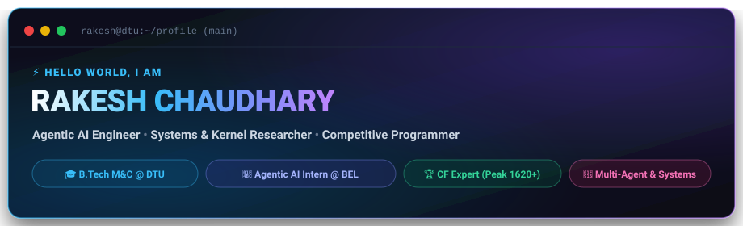

<div align="center">

  <!-- Header Banner -->
  

  <br/><br/>

  <!-- Quick Social Badges -->
  <a href="https://rakeshchaudhary.space" target="_blank">
    
  </a>
  <a href="https://linkedin.com/in/rakesh-chaudhary--" target="_blank">
    
  </a>
  <a href="https://codeforces.com/profile/rakeshsiwal" target="_blank">
    
  </a>
  <a href="mailto:rakesh_23mc121@dtu.ac.in">
    
  </a>
  <a href="https://github.com/Rakesh404e">
    
  </a>
  

  <br/><br/>

  <h3>
    Final Year Undergrad in Mathematics &amp; Computing @ DTU &bull; Agentic AI Intern @ Bharat Electronics (BEL) &bull; Systems &amp; Reinforcement Learning Enthusiast
  </h3>

  <p align="center">
    <em>"Bridging deep mathematical foundations, autonomous multi-agent systems, and low-level kernel engineering."</em>
  </p>

</div>

---

### ⚡ Executive Summary

Hello! I'm **Rakesh Chaudhary**, a final-year undergraduate in **Mathematics &amp; Computing** at **Delhi Technological University (DTU)**. My engineering focus sits at the intersection of **Agentic AI &amp; Multi-Agent Reasoning**, **Reinforcement Learning (MAPPO)**, **High-Performance Systems (OS Kernels &amp; Allocators)**, and **Competitive Algorithmic Problem Solving**.

- 💼 **Production AI**: **Agentic AI Intern** at **Bharat Electronics Limited (Central Research Laboratory - CRL, BEL)**, engineering production RAG microservices, multi-agent evaluation loops, and secure semantic search pipelines across 25,000+ sensitive defense records.
- 🔬 **Wireless &amp; RL Research**: Designed a **Multi-Agent Reinforcement Learning (MAPPO)** framework for UAV-assisted NOMA-ISAC wireless networks under Prof. Sayak Chowdhury (Dept. of CSE), achieving up to 53.1% communication delay reduction over baseline RL models.
- 💻 **Systems &amp; Low-Level Engineering**: Engineered core OS kernel subsystems in C (**GemOS**) featuring custom `mmap`/`mremap` allocators with Copy-on-Write (CoW), page table traversal, and round-robin scheduling.
- 🏆 **Algorithmic Mastery**: **Codeforces Expert** (Peak Rating **1620+**, handle: [`rakeshsiwal`](https://codeforces.com/profile/rakeshsiwal)), **600+ algorithmic problems** solved across LeetCode &amp; Codeforces, with global contest ranks of **312** and **466** (Div. 2) among 15,000+ participants.

---

### 📊 By The Numbers

<div align="center">
  <table>
    <tr>
      <td align="center" width="25%">
        <h3>🏆 1620+</h3>
        <p><b>Codeforces Expert Tier</b><br/>Global Ranks 312 &amp; 466 (Div. 2)</p>
      </td>
      <td align="center" width="25%">
        <h3>🧩 600+</h3>
        <p><b>DSA Problems Solved</b><br/>LeetCode &amp; Codeforces</p>
      </td>
      <td align="center" width="25%">
        <h3>🤖 25,000+</h3>
        <p><b>Defense Docs Indexed</b><br/>Agentic RAG @ BEL</p>
      </td>
      <td align="center" width="25%">
        <h3>🎯 94.2%</h3>
        <p><b>RAG Retrieval Accuracy</b><br/>40% Hallucination Reduction</p>
      </td>
    </tr>
    <tr>
      <td align="center" width="25%">
        <h3>🚦 45+ FPS</h3>
        <p><b>Real-Time Vision Pipeline</b><br/>YOLOv8 Traffic Flow System</p>
      </td>
      <td align="center" width="25%">
        <h3>📉 -21.0%</h3>
        <p><b>Latency Reduction</b><br/>Multi-Agent PPO (MAPPO)</p>
      </td>
      <td align="center" width="25%">
        <h3>🌟 Top 15%</h3>
        <p><b>AlgoUniversity Fellowship</b><br/>Stage 1 (20,000+ applicants)</p>
      </td>
      <td align="center" width="25%">
        <h3>🎓 93.25%ile</h3>
        <p><b>JEE Mains 2023</b><br/>Qualified JEE Advanced</p>
      </td>
    </tr>
  </table>
</div>

---

### 🛠️ Technical Arsenal

<div align="center">
  
</div>

<br/>

| Domain | Technologies, Frameworks &amp; Methodologies |
| :--- | :--- |
| **Languages** | Python, C/C++, JavaScript (ES6+), SQL, Bash scripting, HTML5/CSS3 |
| **Agentic AI &amp; LLM Systems** | LangGraph, LangChain, ChromaDB, FAISS, Hybrid Search, Cross-Encoder Reranking, Self-Corrective RAG |
| **Machine Learning &amp; Computer Vision** | PyTorch, TensorFlow, YOLOv8, OpenCV, Scikit-learn, NumPy, Pandas, Matplotlib |
| **Backend &amp; Low-Level Engineering** | FastAPI, Flask, React.js, Node.js, REST APIs, Unix/Linux Syscalls, Custom Allocators (`mmap`/CoW) |
| **Cloud, DevOps &amp; Tools** | Docker, Git, GitHub Actions, Google Cloud Platform (GCP), Linux/Unix CLI, VS Code |
| **Theoretical &amp; Mathematical Pillars** | Data Structures &amp; Algorithms, Operating Systems, DBMS, Computer Networks, Linear Algebra &amp; ODE, Probability &amp; Statistics, Reinforcement Learning (PPO/MAPPO), Cryptography &amp; Merkle Trees |

---

### 🚀 Flagship Projects &amp; Research

<table>
  <tr>
    <td width="50%" valign="top">
      <h3>🤖 Multi-Agent RAG System</h3>
      <p>
        
        
        
      </p>
      <p>Autonomous agentic Retrieval-Augmented Generation system designed for complex, multi-hop semantic Q&amp;A over unstructured knowledge bases.</p>
      <ul>
        <li>Achieved <b>94.2% top-k retrieval accuracy</b> over 10,000+ heterogeneous enterprise documents.</li>
        <li>Architected multi-agent verification feedback loops for self-corrective retrieval, dynamic query rewriting, and <b>hallucination reduction by 40%</b>.</li>
        <li>Engineered context-aware hierarchical chunking and metadata-filtered indexing.</li>
      </ul>
    </td>
    <td width="50%" valign="top">
      <h3>🚦 Real-Time Traffic Flow Optimizer</h3>
      <p>
        
        
        
      </p>
      <p>Intelligent computer vision pipeline for dynamic urban intersection management through real-time vehicular density estimation.</p>
      <ul>
        <li>High-accuracy vehicle detection and queue counting operating at <b>45+ FPS</b>.</li>
        <li>Designed adaptive density estimation algorithms that dynamically calibrate green-signal durations, <b>reducing simulated intersection delays by 32%</b>.</li>
        <li>Shipped end-to-end video processing pipelines with real-time congestion telemetry.</li>
      </ul>
    </td>
  </tr>

  <tr>
    <td width="50%" valign="top">
      <h3>💻 Building GemOS (x86 OS Kernel)</h3>
      <p>
        
        
        
      </p>
      <p>Academic operating system kernel implementation built under Prof. Debadatta Mishra exploring virtual memory and concurrency.</p>
      <ul>
        <li>Engineered custom <code>mmap</code> and <code>mremap</code> memory allocators with <b>Copy-on-Write (CoW)</b> for efficient process memory duplication.</li>
        <li>Built hardware page table walkers, kernel trace buffers, and user-level segment inspection utilities.</li>
        <li>Implemented round-robin process scheduling and semaphores for thread synchronization.</li>
      </ul>
    </td>
    <td width="50%" valign="top">
      <h3>⛓️ Decentralized Blockchain Ledger Engine</h3>
      <p>
        
        
        
      </p>
      <p>Distributed ledger engine built under Prof. Somitra Sanadhya featuring custom cryptographic proofs and UTXO validation.</p>
      <ul>
        <li>Implemented <b>ECDSA (secp256k1)</b> key generation, signature generation, and verification paired with SHA-256 Merkle trees with $O(\log N)$ inclusion proofs.</li>
        <li>Constructed a configurable Proof-of-Work consensus engine with block-hash chain integrity verifier.</li>
        <li>Engineered a UTXO transaction state machine with double-spend protection and P2PKH script execution.</li>
      </ul>
    </td>
  </tr>

  <tr>
    <td width="50%" valign="top">
      <h3>📈 AlgoRisk Insights (Quant Engine)</h3>
      <p>
        
        
      </p>
      <p>Quantitative finance framework built with the Finance and Analytics Club implementing statistical arbitrage and risk modeling.</p>
      <ul>
        <li>Developed <b>Pairs Trading &amp; Mean Reversion</b> strategies using econometric tests: ADF, KPSS, Ljung-Box, Granger Causality, and Durbin-Watson.</li>
        <li>Engineered high-performance backtesting engine supporting Trailing Stop Loss, Take Profit, and portfolio risk management via CAPM &amp; CPPI.</li>
      </ul>
    </td>
    <td width="50%" valign="top">
      <h3>🛰️ NOMA-ISAC via Multi-Agent PPO</h3>
      <p>
        
        
      </p>
      <p>Undergraduate research under Prof. Sayak Chowdhury on autonomous UAV swarm communication and radar sensing optimization.</p>
      <ul>
        <li>Modeled a realistic wireless RL environment with user mobility, DWAHC clustering, Rayleigh fading, and Successive Interference Cancellation (SIC).</li>
        <li>Benchmarked 11 MAPPO models; yielded <b>21.0% lower latency</b> and <b>12.0% higher reward</b> over Dueling DQN baselines (up to 53.1% delay reduction).</li>
      </ul>
    </td>
  </tr>

  <tr>
    <td colspan="2" valign="top">
      <h3>🎯 Grid-World MDP Solver &amp; Neural Policy Optimization</h3>
      <p>
        
        
        
      </p>
      <p>Advanced reinforcement learning course project under Prof. Washim Mondal exploring Markov Decision Process solvers and policy gradient dynamics.</p>
      <ul>
        <li>Constructed a custom predator-prey MDP; implemented and proved convergence for Value Iteration and Policy Iteration across 144 discrete states.</li>
        <li>Designed a model-free kernel estimator executing <b>78,000+ simulator rollouts per trial</b>, analyzing empirical variance and convergence bounds across seeds.</li>
        <li>Trained deep neural policy networks with <b>REINFORCE</b>, evaluating SGA vs. Adam optimizers on policy stability and convergence speed.</li>
      </ul>
    </td>
  </tr>
</table>

---

### 💼 Professional &amp; Research Experience

```
Bharat Electronics Limited (BEL) | Central Research Laboratory-BEL, Ghaziabad
┌─ Agentic AI Intern
│  June 2026 – Present
│  • Built enterprise RAG microservice indexing 25,000+ defense records into ChromaDB & FAISS.
│  • Ingestion pipeline cut document lookup time by 85% across multi-format files.
│  • Designed multi-agent reasoning workflows using LangGraph & LangChain, boosting precision by 34%.
│  • Implemented hybrid search, cross-encoder reranking, and RBAC controls (92% top-k accuracy, 0 data leaks).
│  • Shipped on-premise containerized deployment with Docker & FastAPI backed by structured telemetry.
└─────────────────────────────────────────────────────────────────────────────
```

```
Department of Computer Science & Engineering | Delhi Technological University
┌─ Undergraduate Researcher (Supervised by Prof. Sayak Chowdhury)
│  January 2026 – April 2026
│  • Developed multi-UAV NOMA-ISAC optimization framework balancing communication & sensing metrics.
│  • Built realistic RL environment modeling user mobility, Rayleigh fading, and SIC interference.
│  • Benchmarked 11 MAPPO models; achieved 21.0% lower delay and up to 53.1% peak delay reduction.
└─────────────────────────────────────────────────────────────────────────────
```

---

### 📚 Academic &amp; Mathematical Rigor (DTU)

**Degree**: B.Tech in Mathematics &amp; Computing | **Delhi Technological University (DTU)** | 2023 – Present (CPI: 7.4/10)

| Core Computer Science &amp; Systems | Mathematics &amp; Computational Intelligence |
| :--- | :--- |
| • Data Structures &amp; Algorithms | • Linear Algebra &amp; Ordinary Differential Equations |
| • Operating Systems &amp; Kernels | • Probability &amp; Statistics |
| • Computer Networks | • Foundations of Modern AI &amp; Deep Learning |
| • Database Management Systems (DBMS) | • Discrete Mathematics |
| • Computer Organisation &amp; Architecture | • Introduction to Machine Learning |
| • Theory of Computation | • Computer Vision &amp; Deep Learning |
| • Software Engineering &amp; DevOps | • Quantum Computing |
| • Parallel Programming | • Blockchain Technology &amp; Applications |

---

### 🏆 Honors, Competitions &amp; Scholastic Milestones

- **Codeforces Expert Tier**: Achieved a peak rating of **1620+** on Codeforces ([`rakeshsiwal`](https://codeforces.com/profile/rakeshsiwal) / [`rakesh404e`](https://github.com/Rakesh404e)).
- **Div. 2 Global Contests**: Secured ranks **312** and **466** in official Codeforces rounds out of 15,000+ international participants.
- **600+ Algorithmic Challenges**: Rigorously solved over 600 data structures &amp; algorithmic challenges across LeetCode &amp; Codeforces.
- **AlgoUniversity Technology Fellowship (2024)**: Ranked in the **top 15%** in Stage 1 out of 20,000+ candidates nationwide.
- **JEE Mains 2023**: Secured **93.25 Percentile** among 1.2 million national candidates.
- **JEE Advanced 2023**: Qualified among the top shortlisted ~180,000 candidates nationwide.
- **Academic Excellence Award**: Awarded for **top 1%** scholastic performance in High School Board Examinations (Class X: 92.4%, Class XII: 88.4%).

---

### 📈 Live GitHub Analytics &amp; Activity

<div align="center">
  <table border="0">
    <tr>
      <td align="center">
        
      </td>
      <td align="center">
        
      </td>
    </tr>
    <tr>
      <td colspan="2" align="center">
        
      </td>
    </tr>
  </table>
</div>

---

### 📫 Connect &amp; Collaborate

I am always keen to discuss research collaborations, high-performance systems engineering, or agentic intelligence architectures.

<div align="center">
  <a href="https://rakeshchaudhary.space" target="_blank">
    
  </a>
  &nbsp;
  <a href="https://linkedin.com/in/rakesh-chaudhary--" target="_blank">
    
  </a>
  &nbsp;
  <a href="https://codeforces.com/profile/rakeshsiwal" target="_blank">
    
  </a>
  &nbsp;
  <a href="mailto:rakesh_23mc121@dtu.ac.in">
    
  </a>
</div>

<br/>

<div align="center">
  <sub>Designed with precision &amp; care for <a href="https://github.com/Rakesh404e">Rakesh Chaudhary</a> &bull; Mathematics &bull; Algorithms &bull; Autonomous Systems</sub>
</div>
